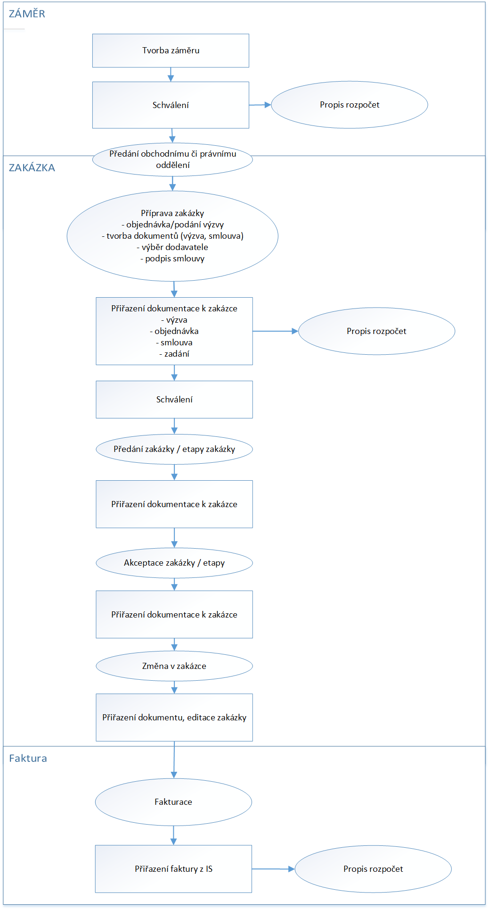
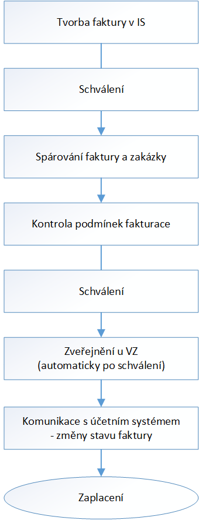

= Správní informační systém: Funkční specifikace
:numbered:
:icons: font
:lang: cs
:note-caption: Poznámka
:warning-caption: Pozor
:table-caption: Tabulka
:figure-caption: Obrázek
:example-caption: Příklad
:toc-title: Obsah
:toc: left
:toclevels: 2
:sectnumlevels: 6
:source-highlighter: pygments

== Úvod

Správní informační systém, zkráceně _SpIS_ je otevřený nástroj pro vedení elektronických evidencí. Měl by zpřehlednit výkon organizačních úkonů, mezi které patří například příprava a jednotlivé kroky pro realizaci veřejných zakázek včetně dodání podkladů pro fakturaci, plánování rozpočtu a jednotlivých výdajových záměrů nebo nastavení pracovních procesů a schvalovacích mechanismů dle rolí přidělených pracovníkům a dodavatelům dané organizace. Zároveň bude systém v praxi evidovat doklady a další dokumenty.

Jeho technickými charakteristikami se zabývá <<technicka-specifikace.adoc#,Technická specifikace>>.

=== Agendy

Systém v prvních verzích umožňuje zpracování agend IPR a NTK souvisejících s přípravou a čerpáním rozpočtu. Systém však musí být navržen s ohledem na budoucí rozvoj, při kterém dojde k rozšíření následujícího seznamu zajišťovaných agend.

Řízení výdajů::
Sekce řízení výdajů sdružuje řadu témat, která se dotýkají výdajových procesů různých typů. Jedná se například o tvorbu a evidenci záměrů, veřejných zakázek, předávacích protokolů, faktur a dalších souvisejících dokumentů.

Rozpočtování::
Sekce rozpočtu sdružuje témata související s přípravou, úpravami a sledováním čerpání prostředků z rozpočtu. Umožňuje jeho sestavování s přihlédnutím k plánovaným nákupům a platným smlouvám.

Partneři a smlouvy::
Sekce partnerů a smluv se soustředí na téma evidence platných smluv a z nich plynoucích závazků. Dále také obsahuje evidenci smluvních partnerů včetně kontaktních informací.

=== Integrace

Pro zpracování výše uvedených agend v systému je nezbytné, aby byl provázán s cizími systémy a mohl tak pracovat s jejich daty. Tyto systémy nejsou v IPR a NTK shodné.

.Cizí systémy, se kterými je potřeba se integrovat
[options="header",cols="<4,^2,^2"]
|===
| Úloha cizího systému               | IPR              | NTK
| Evidence uživatelů                 | Active Directory | OpenLDAP
| Ekonomický systém                  | Ginis            | iFIS
| Elektronický systém spisové služby | E-spis           | iFIS
| Otevřená data                      | CKAN             | CKAN
|===

Systém bude dále napojen na národní Registr smluv, Obchodní rejstřík a Živnostenský rejstřík.

=== Slovník pojmů

Veřejná zakázka (Zakázka)::
Zakázka, která je zadána veřejným subjektem a k jejímu zaplacení se použijí veřejné zdroje. Jedná se o nákup zboží, zadání práce, objednání díla nebo služby. Veřejné zakázky se dělí dle druhu předmětu zakázky (služby, dodávky, stavební práce) a dle předpokládané hodnoty vynaložených prostředků (zakázka malého rozsahu, podlimitní zakázka a nadlimitní zakázka).

Záměr k zadání veřejné zakázky (Záměr)::
Dokument popisující požadavek na pořízení dodávek, služeb nebo stavebních prací. Záměr specifikuje předmět zakázky, předpokládanou hodnotu zakázky a odůvodnění požadavku na vypsání veřejné zakázky. Záměr je zakládajícím dokumentem zakázky.

Objednávka::
Oficiální dokument, kterým je objednán hmotný nebo nehmotný majetek či služba do finančního limitu stanoveného legislativou.

Smlouva::
V kontextu zakázek jde o právní dokument, kterým se písemně stvrzuje dohoda mezi zadavateli zakázky a dodavateli o plnění předmětu a platebních podmínkách.

Výzva k zadání veřejné zakázky (Výzva)::
Právně obchodní dokument, kterým zadavatel vybízí případné zájemce k předložení nabídky. Jedná se o zadání předmětu zakázky, pravidel pro zakázku a všech příslušných právně obchodních náležitostí. Výzva je oficiální dokument a musí být plně v souladu se Zákonem o zadávání veřejných zakázek a dále s Občanským zákoníkem.

Vnitřní sdělení::
Dokument pro interní komunikaci v rámci organizace. Pomocí vnitřního sdělení se oficiálně předávají uvnitř institucí žádosti a informace.

Předávací protokol / dodací list / akceptační protokol::
Dokument, kterým zadavatel od dodavatele přebírá předmět veřejné zakázky či jeho část.

Faktura::
Daňový doklad se všemi zákonnými náležitostmi.

Obchodní případ (Případ)::
Pro účely tohoto dokumentu termín označující celý proces veřejné zakázky, tedy od vytvoření záměru, přes schvalovací řízení, průběh zakázky, až po fakturu, akceptační a předávací protokoly a řádné ukončení zakázky.

Garant::
Osoba, která iniciuje vypsání veřejné zakázky, odpovídá za její plnění, je v kontaktu s obchodním a právním oddělením své organizace a spolupracuje s dodavatelem.

=== Uživatelé

SpIS slouží především nákupčím a právníkům k zajištění vypsání a sledování průběhu veřejných zakázek, dále garantům jednotlivých zakázek k vytvoření záměru a sledování průběhu zakázky a vedení organizace ke sledování finančních toků a plánování rozpočtu. Dalšími uživateli jsou pracovníci IT, kteří systém spravují. Vybrané části systému jsou k dispozici pro nahlížení i ostatním pracovníkům organizace.

.Odhadovaný počet uživatelů v daných rolích
[options="header",cols="<4,^1,^1"]
|===
| Uživatelská role   | IPR | NTK
| Nákupčí a právníci | 15  | 8
| Členové vedení     | 10  | 10
| Garanti zakázek    | 20  | 20
| Správci systému    | 2   | 4
|===

=== Související legislativa

SpIS musí splňovat zákonné požadavky, které jsou na něj kladeny v rámci zákonů souvisejících s informačními systémy, spisovou službou a ochranou osobních údajů. Mezi tyto zákony patří:

* Zákon č. 365/2000 Sb., o informačních systémech veřejné správy
* Zákon č. 300/2008 Sb., o elektronických úkonech a autorizované konverzi dokumentů
* Zákon č. 499/2004 Sb., o archivnictví a spisové službě
* Nařízení Evropského parlamentu a Rady 2016/679 o ochraně fyzických osob v souvislosti se zpracováním osobních údajů a o volném pohybu těchto údajů (obecné nařízení o ochraně osobních údajů)

<<<

== Integrace s cizími systémy

=== Evidence uživatelů

SpIS je přístupný pouze oprávněným pracovníkům, kteří mají platný uživatelský účet v evidenci dané organizace. Oprávnění v rámci systému jsou uživatelům přidělena na základě údajů z této evidence a dále pak správcem přímo v systému.

* IPR uživatele eviduje v systému Microsoft Active Directory. Role je vyjádřena členstvím uživatelů v určitých skupinách. Je tedy potřeba párovat role v systému se skupinami v evidenci.

* NTK uživatele eviduje v systému OpenLDAP s nestandardním schématem. Role přiděluje seznamem institučních rolí u každého uživatele zvlášť. Je tedy potřeba párovat role v systému s institučními rolemi v evidenci.

=== Ekonomický systém

SpIS je provázán s ekonomickým systémem tak, že z něj přebírá a uživatelům poskytuje informace o proplacení evidovaných faktur a to včetně času a výše plateb. SpIS do ekonomického systému naopak předává informace o evidovaných daňových dokladech, aby nebylo nutné doklady evidovat více než jednou.

=== Elektronický systém spisové služby

Napojení na elektronický systém spisové služby (ESSS) bude sloužit jednak k získávání dokumentů a příloh pro další práci s nimi (import) a dále pak pro ukládání hotových dokumentů a příloh za účelem jejich trvalého uchování (export).

==== Import

Import souborů z ESSS pro jejich využití v roli dokumentů, příloh nebo pro rekonstrukci případu probíhá tak, že je oprávněný uživatel prostřednictvím k tomu určeného rozhraní integračního můstku v ESSS vyhledá a vybere.

* Dříve exportované dokumenty ze systému SpIS jsou plnohodnotně importovány a to včetně automatického dohledání jejich příloh na základě v exportu uvedených spisových značek. Import probíhá vždy do konkrétního případu.

* Dříve exportované případy ze systému SpIS jsou plnohodnotně importovány, čímž dojde k vytvoření nového případu. Při tom dojde k dohledání jednotlivých dokumentů na základě v exportu uvedených spisových značek a následně i k dohledání jejich příloh.

* Pokud se jedná o jiný typ souboru, je možné jej použít pouze jako přílohu. V takovém případě je u přílohy uvedena i její spisová značka.

Není žádoucí znovu importovat dokument nebo případ, který již ve SpISu existuje. Pokud na tom uživatel trvá, systém mu umožní tak učinit a případ nebo dokument importovat _jako nový_, což znamená, že dojde k zpřetrhání jeho historických souvislostí.

==== Export

Export případů, dokumentů a příloh do ESSS probíhá automaticky a průběžně. Vždy, když je dokument ve SpISu dokončen, dojde k jeho asynchronnímu exportu a to včetně příloh. Obdobně je exportována konečná podoba případu při jeho uzavření. Dokumenty sdružené ve SpISu do případu se v ESSS řadí do jednoho spisu.

* Spis v ESSS je založen při exportu prvního dokumentu, který do něj má být zařazen.

* V případě, že je jeden dokument použit ve více případech, je exportován pro každý případ zvlášť. Pokud ESSS podporuje řazení dokumentu do více spisů, předejde pomocí této funkce integrační můstek vzniku duplicity.

* Po exportu dokumentu, přílohy nebo případu do ESSS se zaznamená spisová značka, pod kterou je možné výsledný soubor v ESSS dohledat. Při exportu nadřazeného objektu je na dceřinné objekty odkazováno právě pomocí spisových značek.

Do ESSS nejsou exportovány režijní poznámky a přílohy k případu samotnému. Ty mají pouze informativní charakter, nejsou závazné a není třeba je dlouhodobě uchovávat.

=== Elektronické tržiště

Integrační můstek zajišťující napojení na elektronické tržiště (pravděpodobně link:https://nen.nipez.cz/[NEN]) bude zcela řídit profil zadavatele a na základě informací ve SpISu zveřejňovat výzvy, zprostředkovávat průběh řízení a nakonec do systému SpIS přebírat výsledky.

TIP: Elektronické tržiště NEN disponuje link:https://nen.nipez.cz/Soubor.aspx?id=1499363[API na bázi protokolu SOAP].

Pokud vazbu nebude možné z technických nebo jiných důvodů realizovat v plném rozsahu, zajistí můstek alespoň předání podkladů a převzetí výsledků řízení. Obsluha výběrového řízení bude provedena v systému tržiště pověřeným uživatelem.

=== Otevřená data

Integrační můstek automaticky převádí a vkládá data z vybraných datových zdrojů do systému CKAN. Upřesnění datových zdrojů a jejich parametrů je upraveno v souboru ve formátu kompatibilním s popisem pohledu.

=== Registr smluv

Integrační můstek využívá výpravnu ESSS pro odesílání dokumentů do Registru smluv a následně API tohoto registru pro kontrolu jejich řádného zanesení. Zveřejněny budou přílohy závislostí v roli _Ke zveřejnění_ všech dokumentů typu _Potvrzení o zveřejnění v Registru smluv_. Po ověření budou _Potvrzení_ vytvořena, doplněna doložkou v příloze a dokončena.

=== Obchodní a Živnostenský rejstřík

SpIS využívá vlastní adresář smluvních partnerů. Informace o nich pravidelně ověřuje ve veřejně dostupných rejstřících, ve kterých také umožňuje vyhledat nové subjekty a uložit je do místního adresáře. Hledání je možné provést zadáním názvu nebo IČ.

Četnost automatické kontroly platnosti údajů může nastavit správce systému. V případě potřeby je také možné provést kontrolu platnosti údajů u vybraného subjektu na požádání ihned. Automaticky se kontrolují ty subjekty, kterých se týkají některé otevřené případy.

V případě nalezení změn jsou kontaktní údaje subjektu v systému aktualizovány.

<<<

== Zpracování obchodního případu

Dokumenty, které definují rámec obchodního případu, podléhají schvalovacímu procesu. Jedná se především o záměry, objednávky, výzvy či oznámení, smlouvy včetně příloh a dodatků, faktury, vnitřní sdělení a další. Tyto dokumenty jsou schvalovány interně nastaveným procesem, který se v jednotlivých organizacích liší.

Schvalovací proces bude definován pro každou organizaci samostatně dle jejích specifických požadavků. Tato kapitola popisuje obecné požadavky na možnosti nastavení pracovních postupů a obecný popis procesu realizace zakázky.

V rámci implementační analýzy bude pro každou organizaci specifikován pracovní model pro každý typ dokumentu a uživatele. Administrátor systému bude mít oprávnění nastavovat změny v připravených procesech či nastavit nový proces včetně definice dotčených uživatelů, jejich povinností a práv, stejně tak i nastavení dokumentů, jejich stavů a možných akcí.

=== Obecný postup

Obchodní případ vzniká vytvořením záměru, kde obvykle garant či vedoucí pracovník definuje, co a za jakých okolností navrhuje realizovat (specifikuje předmět veřejné zakázky) a odhadne finanční a časový rozsah zakázky. Záměr prochází schvalovacím procesem, po jehož schválení se z návrhu na realizaci stává veřejná zakázka. Dle rozsahu je obvykle specifikován časový harmonogram, finanční náročnost, způsob vypsání zakázky a výběru dodavatele. Připraví se všechny doprovodné dokumenty, které rovněž podléhají procesu schválení vedením. Zakázka je vypsána, proběhne výběr dodavatele, schválení výběru a podpis smlouvy.

Po podpisu smlouvy začíná realizace samotné zakázky. Zakázka může obsahovat několik etap, na jejichž konci je část zakázky vždy předána dodavatelem ke schválení. V rámci každé etapy probíhá obvykle také fakturace.

Faktura je do systému vložena pracovníkem podatelny, její přiřazení ke konkrétní veřejné zakázce a schválení je však určeno dalším procesem. Akceptace etap a fakturace se opakuje až do skončení trvání veřejné zakázky.

SpIS bude po přihlášení prostřednictvím notifikací upozorňovat uživatele na dokumenty, u kterých se očekává jeho schválení či jiná součinnost pro jejich dokončení, případně změny u dokumentů, u kterých si uživatel nastavil sledování.

Schéma zpracování obchodního případu je v příloze 1, schéma zpracování faktury v příloze 2.

=== Evidence obchodních případů

Systém bude umožňovat vedení evidence obchodních případů, přes kterou bude možné dohledat veškeré dokumenty související s daným případem. Mezi tyto dokumenty se řadí zejména záměry (formuláře záměrů, přípravy finančních operací, investiční záměry), dokumentace související s veřejnými zakázkami (zadávací dokumentace, smlouvy, výzvy k podání nabídek, komunikace s uchazeči, zápisy z výběrových řízení) a fakturace (faktury či jiné doklady a podklady k proplacení jako například akceptační protokoly a další).

==== Evidence záměrů

Záměr je inicializační dokument k obchodnímu případu, kde je definováno, co a za jakých okolností se navrhuje realizovat (specifikuje se předmět veřejné zakázky). Autor bude tvorbou proveden pomocí jednoduchého formuláře. Záměr prochází schvalovacím procesem, který je daný v rámci každé organizace, zároveň musí systém reflektovat případné změny v jejich vnitřním chodu.

Záměr je po celou dobu schvalovacího procesu dostupný pro editace a připomínkování. V průběhu schvalování záměru musí mít každý člen schvalovací procedury možnost záměr připomínkovat. Zároveň musí být záměr dostupný i v původních verzích v historii záměru.

Každá změna v údaji záměru a akce v rámci jeho schvalování bude uložena v předchozích verzích a revizích a dostupná oprávněným uživatelům. Změny v záměru budou jasně odlišené od původní verze včetně autora změny.

Schvalování záměru musí proběhnout plně elektronicky s prokazatelnou a unikátní akceptací definovanými pracovníky. Schvalování záměru musí probíhat včetně všech souvisejících příloh k záměru. Na vybrané změny budou uživatelé upozorněni notifikací.

Po konečném schválení záměru je na jeho základě vytvořena veřejná zakázka, pro kterou je záměr základem. Záměr tedy vždy iniciuje objednávku, nebo výzvu k podání nabídek.

Formulář na tvorbu záměru bude obsahovat pole s více datovými typy, jejichž hodnoty se budou plnit ručně i automaticky, včetně možnosti nahrávání dokumentů a číselníků definovaných zadavatelem. Dle zadaného obsahu či zvolené hodnoty číselníku se může lišit obsah dalších polí či navazující zpracování obchodního případu.

Součástí formuláře bude i věcná nápověda k vyplňování a výběru hodnot z číselníků (např. kdy se jedná o objednávku, zjednodušené výběrové řízení atp.). Obsah nápovědy i číselníky bude možné spravovat v administraci systému.

Detailní specifikace procesu pro jednotlivé organizace bude provedena v rámci implementační analýzy.

==== Evidence veřejných zakázek

Evidence veřejných zakázek je stěžejní agendou obchodního a právního oddělení organizace. Jsou zde evidovány všechny veřejné zakázky, od zakázek malého rozsahu až po nadlimitní zakázky. Evidence veřejných zakázek je souhrnný přehled všeho, co je k zakázce evidováno, o vynaložené částce, termínech plnění, stavu jednotlivých částí (faktura, smlouva,…) ve všech etapách realizace. Informace o zakázce jsou přebírány ze záměru, ze kterého zakázka vznikla. Zakázka je postupně doplňována o další informace a dokumenty. Součástí každé veřejné zakázky jsou dále faktury (spárované z evidence faktur), objednávka, smlouva, vnitřní sdělení a další potřebné dokumenty a přílohy. Z výše uvedených dokumentů, které jsou přiřazeny buď ze související agendy či nahrány jako soubory, se k veřejné zakázce evidují vybrané informace přímo v SpISu.

Po schválení záměru se z něj stává veřejná zakázka, kterou obvykle po ekonomické a právní stránce zpracuje obchodní či právní oddělení organizace a společně s garantem zakázky připraví všechny potřebné dokumenty (smlouvu, objednávku či výzvu), vyvěsí výzvu na web organizace a další příslušná místa. V průběhu přípravy veřejné zakázky jsou do SpISu nahrávány příslušné dokumenty a měněn stav zakázky. Všechny dokumenty musí být odsouhlaseny všemi oprávněnými osobami. Po uběhnutí zákonem stanovených lhůt je vybrán dodavatel a podepsána s ním smlouva. Po podpisu smlouvy jsou do SpISu oprávněnou osobou doplněny závazné termíny pro plnění jednotlivých etap, podmínky akceptace a fakturace a finanční částky vyplývající ze smlouvy či zákona. Smlouva je nahrána do SpISu, ze kterého je taktéž možné ji odeslat do ESSS, nahrát na web zadavatele či veřejný registr smluv. V rámci jednotlivých etap veřejné zakázky jsou sledovány limity vynaložených prostředků a skutečně vynaložených prostředků. V okamžiku přijetí jakékoli faktury k dané zakázce je tato připojena k zakázce a do etap jsou evidovány příslušné částky a termíny. Taktéž při ukončení jednotlivých etap pověřený pracovník připojuje k zakázce předávací protokoly až do ukončení plnění veřejné zakázky.

Dokumenty související s veřejnou zakázkou jsou dostupné pro editace a připomínkování po celou dobu jejího trvání. Veškeré změny k zakázce jsou ukládány v předchozích verzích a revizích dokumentů a jsou dostupné oprávněným uživatelům stejně jako v evidenci záměrů. Na vybrané změny budou vybraní uživatelé upozorňováni notifikací.

Každá veřejná zakázka vychází ze záměru, z něhož převezme všechny informace o celku i o jednotlivých etapách zakázky, tyto informace mohou být následně upraveny dle hodnot ve smlouvě, pokud dojde ke změně. Ke každé zakázce případně jejím jednotlivým etapám jsou přiřazovány dokumenty (smlouva, faktury, předávací protokoly, interní sdělení atp.). Veřejná zakázka i její etapy budou obsahovat informace o termínech plnění, plánovaných a skutečně vynaložených finančních prostředcích.

Detailní specifikace procesu a funkcí pro jednotlivé organizace bude provedena v rámci implementační analýzy.

==== Evidence faktur

Evidence faktur bude obsahovat informace o fakturách zadaných do SpISu oprávněnými pracovníky. Faktury budou evidovány jako dokument v databázi a každý dokument bude mít připojen naskenovaný soubor. Evidence faktur bude propojena s ekonomickým systémem, se kterým si bude pomocí webové služby předávat informace o faktuře a k ní přiložený soubor (či soubory). Z ekonomického systému budou přebírány informace o proplacení faktury.

Faktura je přijata, očíslována a zaevidována do SpISu oprávněným pracovníkem. Dále je předána ke kontrole (datum splatnosti, částka, dodavatel atd.) nadřízenému pracovníkovi, který ji schválí, spáruje s příslušnou veřejnou zakázkou, zkontroluje splnění podmínek k fakturaci u zakázky a případně předá fakturu ke schválení dalším oprávněným osobám. Při spárování faktura převezme potřebné údaje pro účely tvorby rozpočtu a přehledu čerpání financí. Po schválení všemi zúčastněnými stranami je faktura poslána k proplacení do ekonomického systému. Z ekonomického systému jsou přebírány informace o změně stavu faktury a jejím proplacení. Na tyto změny jsou uživatelé upozorňováni notifikací.

=== Adresář dodavatelů

Adresář bude obsahovat seznam dodavatelů a kontaktů uložených ve SpISu, který bude využíván napříč celým systémem při vyplňování dodavatele k záměru či zakázce, pro kontroly faktury atd. Adresář bude napojen na veřejný obchodní a živnostenský rejstřík, ze kterého bude SpIS ověřovat správnost uložených údajů a bude získávat informace o novém dodavateli ukládaném do systému. Ve SpISu bude vyplňováno jméno nebo IČ dodavatele a ostatní informace budou importovány z veřejného rejstříku.

Detailní specifikace obsahu adresáře a jeho funkcí bude provedena v rámci implementační analýzy.

<<<

== Plánování rozpočtu

SpIS bude umožňovat plánování rozpočtu na nadcházející období. Rozpočet bude tvořen jako výstup pro nadřízenou instituci organizace i jako podklad pro plánování a nástroj kontroly nad financemi organizace jako celku i jejích organizačních struktur či jinak definovaných skupin. SpIS bude také poskytovat přehled o plánovaném a skutečném čerpání financí dle požadavků uživatele (např. dle období, dle skupiny či účelu, plán versus skutečné čerpání financí atd.). Přehledy bude možné exportovat a tisknout.

Do rozpočtu na následující období zasahují vždy záměry a zakázky již evidované v systému, jejichž informace budou do rozpočtu přebírány automaticky dle zadaných kritérií. Dále zde budou tvořeny nové zakázky pro účely plánování rozpočtu (plán zakázek). Rozpočet na následující období se obvykle odevzdává společně s přehledem skutečného čerpání financí z aktuálního období.

Plánování rozpočtu bude probíhat prostřednictvím evidence plánovaných zakázek, nástrojů pro tvorbu návrhu rozpočtu pro nadřízený orgán a pro interní plánování a přehledu čerpání rozpočtu dle různých kritérií včetně jeho změn.

=== Plán zakázek

Plán zakázek bude evidenční agenda systému, ve které budou jednotlivé organizační nebo jinak definované celky zadávat plány na veřejné zakázky pro účely plánování rozpočtu na další období. Jedná se o zjednodušenou evidenci zakázek, ze které bude možné zakázku v případě realizace přebrat do evidence záměrů.

Položky plánu budou vytvářet garanti projektů či vedoucí pracovníci. Vytvořený plán bude podléhat schvalovacímu procesu v rámci hierarchie organizace. Schválené položky plánu zakázek budou promítnuty do tvorby rozpočtu.

Detailní specifikace obsahu plánu zakázek pro jednotlivé organizace bude předmětem implementační analýzy.

=== Tvorba rozpočtu

Rozpočet je tvořen jednou za rok na nadcházející období pro nadřízenou instituci organizace. Systém bude umožňovat vytvořit rozpočet i pro jakékoli období, případně pouze dílčí část rozpočtu (například jen investice, jen IT projekty atd.) pro interní účely organizace.

Vstupními daty rozpočtu jsou aktuálně běžící zakázky z evidence zakázek a plánované zakázky z plánu zakázek, případně další k tomu určené a označené přehledy výdajových záměrů. Z evidencí jsou přebírány informace o termínech plnění a finanční částky vynaložené v jednotlivých etapách. Ze všech dostupných informací je vytvořen návrh rozpočtu, který bude možné rozdělit do kapitol dle účelu využití financí, organizačního celku či jiné tematické oblasti.

Návrh rozpočtu je předložen ke schválení nadřízenému orgánu, který schválí plnou částku nebo její část, která je zpětně rozdělena v rámci organizace pro jednotlivé organizační celky dle různých kritérií. Finance přidělené od nadřízeného orgánu jsou do systému vloženy správcem rozpočtu a jsou závazné pro všechny uživatele jako limity čerpání pro další plánování a kontrolu čerpání.

Detailní specifikace procesu a funkcí nástrojů pro tvorbu rozpočtu pro jednotlivé organizace bude předmětem implementační analýzy. Schéma procesu tvorby rozpočtu je v příloze 3.

=== Rozpočet, změny rozpočtu a přehled čerpání

Rozpočet schválený nadřízeným orgánem je závazný pro plánování a přehled čerpání přidělených financí. Částky schválené nadřízeným orgánem rozdělí správce rozpočtu zpětně mezi jednotlivé útvary organizační struktury dle účelu využití. Přidělené částky jsou závazné pro všechny uživatele jako limity čerpání, jejich změnu smí provést pouze správce rozpočtu na základě rozhodnutí nadřízeného orgánu.

V jednotlivých organizacích je možné v rámci limitů čerpání přerozdělovat finance mezi útvary organizační struktury a měnit účel jejich vynaložení. Tyto změny může provádět pouze správce rozpočtu a jsou schvalovány vedoucími pracovníky, jichž se změny týkají.

Systém bude poskytovat kontrolu čerpání rozpočtu prostřednictvím přehledu sum čerpaných financí a jejich limitů dle jednotlivých schválených rozpočtových položek. Výpočty budou dynamické a budou odpovídat zadaným filtrům.

Detailní specifikace obsahu a funkcí přehledu čerpání rozpočtu bude předmětem implementační analýzy.

== Přílohy
=== Schéma zpracování obchodního případu

<<<

=== Schéma zpracování faktury

<<<

=== Schéma procesu tvorby rozpočtu

image:media/image5.png[width=400]

// vim:set spelllang=cs:
