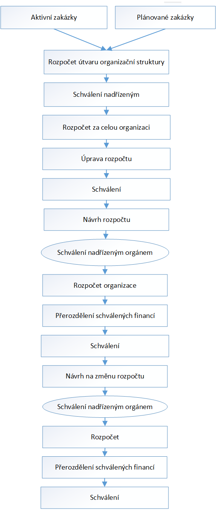

= Správní informační systém: Funkční specifikace
:numbered:
:icons: font
:lang: cs
:note-caption: Poznámka
:warning-caption: Pozor
:table-caption: Tabulka
:figure-caption: Obrázek
:example-caption: Příklad
:toc-title: Obsah
:toc: left
:toclevels: 2
:sectnumlevels: 6

== Úvod

Správní informační systém, zkráceně _SpIS_ je otevřený nástroj pro vedení elektronických evidencí. Měl by zpřehlednit výkon organizačních úkonů, mezi které patří například příprava a jednotlivé kroky pro realizaci veřejných zakázek včetně dodání podkladů pro fakturaci, plánování rozpočtu a jednotlivých výdajových záměrů nebo nastavení pracovních procesů a schvalovacích mechanismů dle rolí přidělených pracovníkům a dodavatelům dané organizace. Systém bude tedy v praxi evidovat doklady a další dokumenty.

Jeho technickými charakteristikami se zabývá <<technicka-specifikace.adoc#,Technická specifikace>>.

=== Agendy

Systém v prvních verzích umožňuje zpracování následujících agend IPR a NTK. Systém by však měl být konstruován s ohledem na budoucí rozvoj, při kterém dojde k rozšíření seznamu níže.

Řízení výdajů::
Sekce řízení výdajů sdružuje řadu témat, která se dotýkají výdajových procesů různých typů. Jedná se například o tvorbu a evidenci záměrů, veřejných zakázek, předávacích protokolů, faktur a dalších, souvisejících dokumentů.

Rozpočtování::
Sekce rozpočtu sdružuje témata související s přípravou, úpravami a sledováním čerpání prostředků z rozpočtu. Umožňuje jeho sestavování s přihlédnutím k plánovaným nákupům a platným smlouvám.

Partneři a smlouvy::
Sekce partnerů a smluv se soustředí na téma evidence platných smluv a z nich plynoucích závazků. Dále také obsahuje evidenci smluvních partnerů včetně kontaktních informací.

=== Integrace

Aby bylo možné zpracovávat v systému agendy uvedené výše, je potřeba, aby byl systém provázán s cizími systémy a mohl tak pracovat s jejich daty. Tyto systémy nejsou v IPR a NTK shodné.

.Cizí systémy, se kterými je potřeba se integrovat
[options="header",cols="<4,^2,^2"]
|===
| Úloha cizího systému               | IPR              | NTK
| Evidence uživatelů                 | Active Directory | OpenLDAP
| Ekonomický systém                  | Ginis            | iFIS
| Elektronický systém spisové služby | E-spis           | iFIS
| Elektronické tržiště               | ?                | TenderMarket
| Otevřená data                      | CKAN             | CKAN
|===

Systém bude dále napojen na národní Registr smluv a Obchodní a Živnostenský rejstřík.

=== Slovník pojmů

Veřejná zakázka (Zakázka)::
Zakázka, která je zadána veřejným subjektem a k jejímu zaplacení se použijí veřejné zdroje. Jedná se o nákup zboží, zadání práce, objednání díla nebo služby. Veřejné zakázky se dělí dle druhu předmětu zakázky (služby, dodávky, stavební práce) a dle předpokládané hodnoty vynaložených prostředků (zakázka malého rozsahu, podlimitní zakázka a nadlimitní zakázka).

Záměr k zadání veřejné zakázky (Záměr)::
Dokument popisující požadavek na pořízení dodávek, služeb nebo stavebních prací. Záměr specifikuje předmět zakázky, předpokládanou hodnotu zakázky a odůvodnění požadavku na vypsání veřejné zakázky. Záměr je základním dokumentem zakázky.

Objednávka::
Oficiální dokument, kterým je objednán hmotný nebo nehmotný majetek či služba do finančního limitu stanoveného legislativou.

Smlouva::
V kontextu zakázek jde o právní dokument, kterým se písemně stvrzuje dohoda mezi zadavateli zakázky a dodavateli o plnění předmětu a platebních podmínkách.

Výzva k zadání veřejné zakázky (Výzva)::
Právně obchodní dokument, kterým zadavatel vybízí případné zájemce k předložení nabídky. Jedná se o zadání předmětu zakázky, pravidel pro zakázku a všech příslušných právně obchodních náležitostí. Výzva je oficiální dokument a musí být plně v souladu se Zákonem o zadávání veřejných zakázek a dále s Občanským zákoníkem.

Vnitřní sdělení::
Dokument pro interní komunikaci v rámci organizace. Pomocí vnitřního sdělení se oficiálně předávají uvnitř institucí žádosti a informace.

Předávací protokol / dodací list / akceptační protokol::
Dokument, kterým zadavatel od dodavatele přebírá předmět veřejné zakázky či jeho část.

Faktura::
Daňový doklad se všemi zákonnými náležitostmi.

Obchodní případ::
Pro účely tohoto dokumentu termín označující celý proces veřejné zakázky, tedy od vytvoření záměru, přes schvalovací řízení, průběh zakázky, až po fakturu, akceptační a předávací protokoly a řádné ukončení zakázky.

Garant::
Osoba, která iniciuje vypsání veřejné zakázky, odpovídá za její plnění, je v kontaktu s obchodním a právním oddělením své organizace a spolupracuje s dodavatelem.

=== Uživatelé

SpIS slouží především nákupčím a právníkům k zajištění vypsání a sledování průběhu veřejných zakázek, dále garantům jednotlivých zakázek k vytvoření záměru a sledování průběhu zakázky a vedení organizace ke sledování finančních toků a plánování rozpočtu. Dalšími uživateli jsou pracovníci IT, kteří systém spravují. Vybrané části systému jsou k dispozici pro nahlížení i ostatním pracovníkům.

.Odhadovaný počet uživatelů v daných rolích
[options="header",cols="<4,^1,^1"]
|===
| Uživatelská role   | IPR | NTK
| Nákupčí a právníci | 15  | 8
| Členové vedení     | 10  | 10
| Garanti zakázek    | 20  | 20
| Správci systému    | 2   | 4
|===

<<<

== Integrace s cizími systémy

=== Evidence uživatelů

SpIS je přístupný pouze oprávněným pracovníkům, kteří mají platný uživatelský účet v evidenci. Oprávnění v rámci systému jsou uživatelům přidělena na základě údajů z této evidence a dále pak správcem přímo v systému.

* IPR uživatele eviduje v systému Microsoft Active Directory. Role je vyjádřena členstvím uživatelů v určitých skupinách. Je tedy potřeba párovat role v systému se skupinami v evidenci.

* NTK uživatele eviduje v systému OpenLDAP s nestandardním schématem. Role přiděluje seznamem institučních rolí u každého uživatele zvlášť. Je tedy potřeba párovat role v systému s institučními rolemi v evidenci.

=== Ekonomický systém

SpIS je provázán s ekonomickým systémem tak, že z něj přebírá a uživatelům poskytuje informace o proplacení evidovaných faktur a to včetně času a výše plateb. SpIS do účetního systému naopak předává informace o evidovaných daňových dokladech, aby nebylo nutné doklady evidovat více než jednou.

=== Elektronický systém spisové služby

WARNING: Dopsat. Viz úkol #13.

=== Elektronické tržiště

WARNING: Dopsat.

=== Otevřená data

WARNING: Dopsat.

=== Registr smluv

WARNING: Dopsat.

=== Obchodní a Živnostenský rejstřík

SpIS využívá vlastní adresář smluvních partnerů. Informace o nich pravidelně ověřuje ve veřejně dostupných rejstřících, ve kterých také umožňuje vyhledat nové subjekty a uložit je do místního adresáře. Hledání je možné provést zadáním názvu nebo IČ.

Četnost automatické kontroly platnosti údajů může nastavit správce systému. V případě potřeby je také možné provést kontrolu platnosti údajů u vybraného subjektu na požádání ihned. Automaticky se kontrolují ty subjekty, kterých se týkají některé otevřené projekty.

V případě nalezení změn jsou kontaktní údaje subjektu v systému aktualizovány.

<<<

== Workflow obchodního případu

Dokumenty, které definují rámce obchodního případu, podléhají schvalovacímu procesu. Jedná se především o záměry, objednávky, výzvy či oznámení, smlouvy včetně příloh a dodatků, faktury, vnitřní sdělení a další. Tyto dokumenty jsou schvalovány interně nastaveným procesem, který se v jednotlivých organizacích liší.

Schvalovací proces bude definován pro každou organizaci samostatně dle jejích specifických požadavků. Tato kapitola popisuje obecné požadavky na možnosti nastavení workflow a obecný popis procesu realizace VZ.

=== Nastavení workflow

V rámci implementační analýzy bude pro každou organizaci specifikován workflow model pro každý typ dokumentu a uživatele. Administrátor systému bude mít právo v modulu nastavovat změny v připravených procesech či nastavit nový, včetně definice dotčených uživatelů, jejich povinností a práv v rámci procesu. Dále i nastavení dokumentů, jejich stavů a možných akcí.

=== Obecný postup

Obchodní případ vzniká vytvořením záměru, kde obvykle garant či vedoucí pracovník definuje, co a za jakých okolností navrhuje realizovat (specifikuje předmět veřejné zakázky), odhadne finanční a časový rozsah záměru. Záměr prochází schvalovacím procesem, po jehož schválení se z návrhu na realizaci stává veřejná zakázka. Dle rozsahu je obvykle specifikován časový harmonogram, finanční náročnost, způsob vypsání zakázky a výběru dodavatele. Připraví se všechny doprovodné dokumenty, jejichž schválení podléhá taktéž určitému procesu schválení vedení. Zakázka je vypsána, proběhne výběr dodavatele, schválení výběru a podpis smlouvy.

Po podpisu smlouvy začíná realizace samotné zakázky. Zakázka může obsahovat několik etap, na jejichž konci je část zakázky vždy předána dodavatelem ke schválení. V rámci každé etapy probíhá obvykle také fakturace.

Faktura má v rámci IS vlastní workflow. Faktura je do systému vložena pracovníkem podatelny, její přiřazení ke konkrétní veřejné zakázce a schválení je však určeno dalším procesem.

Akceptace etap a fakturace se opakuje až do skončení trvání veřejné zakázky.

Schéma obecného workflow obchodního případu je v příloze 2, schéma workflow faktury v příloze 4.

=== Schvalovací centrum

IS bude obsahovat schvalovací centrum -- seznam položek ke schválení po přihlášení konkrétního uživatele. Položky ke schválení musí korespondovat s kompetencemi daného uživatele. Vybrané položky ve schvalovacím centru bude možné kromě schválení i okomentovat a elektronicky podepsat.

Schvalování dokumentů bude umožňovat dynamické změny procesů na základě zodpovědností a kompetencí v rámci organizační struktury.

<<<

== Moduly obchodního případu
=== Evidence záměrů

Modul bude sloužit k vytvoření a evidenci záměrů. Záměr je inicializační dokument k obchodnímu případu, kde je definováno, co a za jakých okolností se navrhuje realizovat (specifikuje se předmět veřejné zakázky). Autor bude tvorbou proveden pomocí jednoduchého formuláře. Záměr prochází schvalovacím procesem, který je daný v rámci každé organizace, ale zároveň IS musí reflektovat případné změny v jejich vnitřním chodu.

Záměr je po celou dobu schvalovacího procesu dostupný pro editace a připomínkování. V průběhu schvalování záměru musí mít každý člen schvalovací procedury možnost záměr připomínkovat. Zároveň musí být záměr dostupný i v původních verzích v historii záměru.

Každá změna v údaji záměru a akce v rámci jeho schvalování bude uložena v logu a dostupná oprávněným uživatelům. Změny v záměru budou jasně odlišené od původní verze včetně autora změny.

Schvalování záměru musí proběhnout plně elektronicky s prokazatelnou a unikátní akceptací definovanými pracovníky. Schvalování záměru musí probíhat včetně všech souvisejících příloh k záměru. Na vybrané změny budou uživatelé upozorněni notifikací.

Po konečném schválení záměru je na jeho základě vytvořena veřejná zakázka, pro kterou je záměr základem. Záměr tedy vždy iniciuje objednávku, nebo výzvu k podání nabídek.

Formulář na tvorbu záměru bude obsahovat pole s více datovými typy, jejichž hodnoty se budou plnit ručně i automaticky, včetně možnosti nahrávání dokumentů a číselníků definovaných zadavatelem. Dle zadaného obsahu či zvolené hodnoty číselníku se může lišit obsah dalších polí či navazující workflow zpracování obchodního případu.

Součástí formuláře bude i věcná nápověda k vyplňování a výběru hodnot z číselníků (např. kdy se jedná o objednávku, zjednodušené výběrové řízení atp.). Obsah nápovědy i číselníky bude možné spravovat v administraci systému.

Detailní specifikace procesu pro jednotlivé organizace bude provedena v rámci implementační analýzy.

==== Návrh evidovaných informací o záměru

* Název
* Evidenční číslo
* Vymezení předmětu VZ
* Důvod zadání
* Účel zajištění činnosti
* Způsob zadání VZ
* Předpokládaná hodnota (bez DPH i s DPH)
* Druh finančních prostředků
* Typ čerpání rozpočtu
* Předpokládaný termín dokončení zakázky
* Garant

Metadata záměru

* Datum vytvoření
* Autor vytvoření
* Datum poslední změny
* Autor poslední změny

Další

* Poznámka garanta
* Přílohy (včetně metadat o dokumentech -- datum nahrání, změny a autor)
* Podmínky fakturace
* Etapy záměru
** Název
** Částka bez DPH
** Částka s DPH
** Druh financí
** Datum zahájení
** Datum ukončení
* Text storna záměru

Informace spojené se schvalováním záměru

* Stav schválení záměru (metadata o stavu v rámci workflow -- datum předání ke schválení, aktuální schvalovatel)
* Zpracovatel/Vyřizuje
* Datum schválení záměru

==== Seznam záměrů

Součástí modulu bude přehledný seznam všech záměrů v IS, přizpůsobený preferencím a právům konkrétního uživatele. V seznamu bude možné hledat, filtrovat a řadit záměry dle všech atributů či přednastavených rychlých filtrů (vlastní uživatelské nastavení).

==== Funkce a kontroly modulu

* Uložení či tisk rozpracované verze záměru
* Tisk záměru (tiskárna, PDF)
* Export a tisk seznamu záměrů (XLS, CSV, PDF)
* Tiskové sestavy
* Přidání komentáře či připomínky k položkám záměru i jeho etapám
* Historie záměru -- odkaz do logu změn
* Kontrola zadání duplicitního záznamu záměru či dodavatele
* Kontrola dodržení finančních limitů dle druhu zakázky
* Notifikace uživatelů při změně v záměru
* Schválení (odeslání záměru ke schválení dalšímu uživateli v rámci workflow)
* Uzavření záměru (uzamknutí jako podkladu pro zakázku, včetně příloh) -- záměr je převeden kompletně na zakázku

=== Evidence veřejných zakázek

Evidence VZ je stěžejní agendou obchodního a právního oddělení organizace. Jsou zde evidovány všechny veřejné zakázky, od zakázek malého rozsahu až po nadlimitní zakázky. Evidence VZ je souhrnný přehled všeho, co je k zakázce evidováno, o vynaložené částce, termínech plnění, stavu jednotlivých částí (faktura, smlouva,…) ve všech etapách realizace. Informace o zakázce jsou přebírány ze záměru, ze kterého zakázka vznikla. Zakázka je postupně doplňována o další informace a dokumenty. Součástí každé veřejné zakázky jsou dále faktury (spárované z evidence faktur), objednávka, smlouva, vnitřní sdělení a další potřebné dokumenty a přílohy. Z výše uvedených dokumentů, které jsou přiřazeny buď ze související agendy či nahrány jako soubory, se k veřejné zakázce evidují vybrané informace přímo v IS.

==== Proces zpracování VZ

Po schválení záměru se z něj stává veřejná zakázka, kterou obvykle po ekonomické a právní stránce zpracuje obchodní či právní oddělení organizace a společně s garantem zakázky připraví všechny potřebné dokumenty (smlouvu, objednávku či výzvu), vyvěsí výzvu na web organizace a další příslušná místa. V průběhu přípravy veřejné zakázky jsou do IS nahrávány příslušné dokumenty a měněn stav zakázky. Všechny dokumenty musí být odsouhlaseny všemi oprávněnými osobami. Po uběhnutí zákonem stanovených lhůt je vybrán dodavatel a podepsána s ním smlouva. Po podpisu smlouvy jsou do IS oprávněnou osobou doplněny závazné termíny pro plnění jednotlivých etap, podmínky akceptace a fakturace a finanční částky vyplývající ze smlouvy či zákona. Smlouva je nahrána do IS, ze kterého je taktéž možné jí odeslat do E-spisu, nahrát na web zadavatele či veřejný rejstřík smluv. V rámci jednotlivých etap VZ jsou sledovány limity vynaložených prostředků a skutečně vynaložených prostředků. V okamžiku přijetí jakékoli faktury (zaevidované v IS v modulu evidence faktur) k dané zakázce je tato připojena k VZ a do etap jsou evidovány příslušné částky a termíny. Taktéž při ukončení jednotlivých etap pověřený pracovník připojuje k VZ předávací protokoly až do ukončení plnění veřejné zakázky.

VZ je dostupná pro editace a připomínkování po celou dobu jejího trvání. Veškeré změny k zakázce jsou ukládány do logu změn a dostupné oprávněným uživatelům stejně jako v evidenci záměrů. Na vybrané změny budou vybraní uživatelé upozorňováni notifikací.

Každá veřejná zakázka vychází ze záměru, z něhož převezme všechny informace o celku i o jednotlivých etapách zakázky, tyto informace mohou být následně upraveny dle hodnot ve smlouvě, pokud dojde ke změně. Ke každé VZ, případně jejím jednotlivým etapám jsou přiřazovány dokumenty (smlouva, faktury, předávací protokoly, interní sdělení atp.). Veřejná zakázka i její etapy budou obsahovat informace o termínech plnění, plánovaných a skutečně vynaložených finančních prostředcích. VZ bude označena volitelným štítkem, který bude sloužit k seskupování tematicky podobných zakázek. Tento štítek bude dostupný při plánování rozpočtu.

==== Návrh informací o zakázce

* Informace přebrané ze záměru
* Evidenční číslo
* Datum podpisu smlouvy
* Účinnost smlouvy
* Vynaložené finance (s DPH, bez DPH)
* Termín ukončení zakázky
* Text storna zakázky

Metadata k zakázce

* Štítek (tematické označení)
* Datum zahájení administrace
* Vyřizuje
* Stav zakázky
* Datum poslední změny
* Autor poslední změny

Druhy příloh zakázky

* Schválený podepsaný tištěný záměr
* Zadání
* SLA
* Výzva / Objednávka
* Smlouva
* Faktura
* Předávací protokol
* Vnitřní sdělení

Ke každé příloze budou evidována metadata: datum importu a uživatel, který dokument nahrál, datum a autor poslední změny. Smlouvu bude možné navíc přes IS odeslat do E-spisu či přímo nahrát na web zadavatele či veřejný rejstřík smluv.

Informace o etapě zakázky navíc oproti záměru

* Skutečná částka s DPH i bez DPH
* Skutečný termín ukončení
* Podmínka fakturace
* Termín fakturace
* Fakturace
* Neuhrazená fakturace

Dokumenty přiřazované k etapě

* Faktura
* Akceptační protokol
* Předávací protokol
* Vnitřní sdělení

Ke každé příloze budou evidována metadata: datum importu a uživatel, který dokument nahrál, datum a autor poslední změny.

==== Seznam zakázek

Součástí modulu bude přehledný seznam všech zakázek v IS, přizpůsobený preferencím a právům konkrétního uživatele. V seznamu bude možné hledat, filtrovat a řadit zakázky dle všech atributů či přednastavených rychlých filtrů. Seznam bude možné exportovat do xls, csv nebo tisknout.

==== Funkce a kontroly modulu

* Tisk informací o zakázce
* Tisk příloh zakázky
* Export a tisk seznamu zakázek
* Tiskové sestavy
* Přidání komentáře či připomínky k VZ i jejím etapám
* Historie veřejné zakázky -- odkaz do logu změn
* Kontrola zadání duplicitního záznamu VZ či dodavatele
* Kontrola dodržení finančních limitů a termínů
* Notifikace uživatelů na změny ve VZ
* Notifikace uživatelů na vypršení termínů (fakturace, konec etapy, zakázky)

Detailní specifikace procesu a funkcí pro jednotlivé organizace bude provedena v rámci implementační analýzy.

=== Evidence faktur

Evidence faktur bude obsahovat informace o fakturách zadaných do IS oprávněnými pracovníky, obvykle z podatelny. Faktury budou evidovány jako záznam v databázi a každý záznam bude mít připojen naskenovaný dokument. Evidence faktur bude propojena s účetním systémem, se kterým si bude pomocí webové služby předávat informace o faktuře a soubor s dokumentem. Z účetního systému budou přebírány informace o proplacení faktury.

==== Proces přijetí a kontroly faktur

Faktura je přijata, očíslována a zaevidována do IS oprávněným pracovníkem (obvykle podatelna). Dále je předána ke kontrole (datum splatnosti, částka, dodavatel atd.) nadřízenému uživateli, který jí schválí, spáruje s VZ, zkontroluje splnění podmínek k fakturaci u zakázky a případně předá fakturu ke schválení dalším oprávněným osobám. Při spárování faktura převezme štítek uvedený u VZ pro účely tvorby rozpočtu a přehledu čerpání financí. Po schválení všemi zúčastněnými stranami je faktura poslána k proplacení do účetního systému. Z účetního systému jsou přebírány informace o změně stavu faktury a jejím proplacení. Na tyto změny jsou uživatelé upozorňováni notifikací.

==== Návrh informací o faktuře

Základní údaje:

* Číslo faktury
* IČ dodavatele
* Dodavatel
* Variabilní symbol
* Zdanitelné plnění
* Datum splatnosti
* Částka s DPH
* Částka v cizí měně
* Měna
* Příloha: Naskenovaná faktura

Metadatové údaje:

* Datum přijetí
* Zpracovatel
* Datum poslední změny
* Autor poslední změny

Další údaje:

* Číslo veřejné zakázky (spárování v IS)
* Štítek veřejné zakázky (spárování v IS)
* Stav v rámci workflow

Externí údaje:

* Datum uhrazení
* Text storna
* Číslo účetního dokladu

Podrobná specifikace významu a seznam položek faktury pro jednotlivé organizace bude součástí implementační analýzy.

==== Seznam faktur

Součástí modulu bude přehledný seznam všech faktur v IS, přizpůsobený preferencím a právům konkrétního uživatele. V seznamu bude možné hledat, filtrovat a řadit faktury dle všech atributů či přednastavených rychlých filtrů. Seznam bude možné exportovat do xls, csv nebo tisknout.

==== Funkce a kontroly modulu

* Uložení či tisk faktury
* Export a tisk seznamu faktur

* Tiskové sestavy
* Synchronizace s účetním systémem
* Historie faktury -- odkaz do logu změn

* Kontrola zadání duplicitního záznamu faktury či dodavatele
* Kontrola dodržení termínů
* Notifikace na změny dle uživatel

=== Adresář dokumentů

Jedná se o doplňkový modul sloužící k jednoduššímu prohlížení a přístupu k dokumentům. Všechny dokumenty nahrávané do IS budou k dispozici v adresáři, v němž bude možné dokumenty filtrovat a vyhledávat dle vybraných atributů. Kromě aktuální verze dokumentu budou dostupné i jeho starší verze. Dokumenty bude možné z tohoto modulu exportovat či tisknout. Nahrávání nových dokumentů bude ale možné pouze přes modul týkající se daného dokumentu (záměr VZ, faktura).

Informace o dokumentu:

* Typ (smlouva, objednávka, vnitřní sdělení atd.)
* Datum poslední úpravy
* ID příslušného záměru
* ID příslušné zakázky

Funkce adresáře

* Export a tisk dokumentů
* Export a tisk seznamu dokumentů
* Verze (odkaz na všechny verze dokumentu)

Podrobný popis významu položek adresáře bude součástí implementační analýzy.

=== Adresář dodavatelů

Adresář bude obsahovat seznam dodavatelů a kontaktů uložených v IS, který bude využíván napříč celým IS při vyplňování dodavatele k záměru či zakázce, pro kontroly faktury atd. Adresář bude napojen na veřejný obchodní a živnostenský rejstřík, ze kterého bude IS ověřovat správnost uložených údajů a bude získávat informace o novém dodavateli ukládaném do IS. V IS bude vyplňováno jméno nebo IČ dodavatele a ostatní informace budou importovány z veřejného rejstříku.

Detailní specifikace obsahu a funkcí modulu bude provedena v rámci implementační analýzy.

Informace o dodavateli:

* Název
* IČ
* Adresa
* Kontakty (telefon, email)
* Bankovní spojení
* Ověřeno v  rejstříku (příznak ověření správnosti údajů)

<<<

== Rozpočet

V IS bude probíhat plánování rozpočtu na nadcházející období. Rozpočet bude tvořen jako výstup pro nadřízenou instituci organizace i jako podklad pro plánování a nástroj kontroly nad financemi organizace jako celku i jejích organizačních struktur či jinak definovaných skupin. Modul rozpočet bude také poskytovat přehled o plánovaném a skutečném čerpání financí dle požadavků uživatele (např. dle období, dle skupiny či účelu, plán versus skutečné čerpání financí atd.). Přehledy bude možné exportovat a tisknout.

Do rozpočtu na následující období zasahují vždy záměry a zakázky již evidované v IS, jejichž informace budou do rozpočtu přebírány automaticky dle zadaných kritérií. Dále budou v modulu tvořeny nové zakázky, čistě pro účely plánování rozpočtu (plán zakázek). Rozpočet na následující období se obvykle odevzdává společně s přehledem skutečného čerpání financí z aktuálního období.

Součástí modulu bude evidence plánovaných zakázek, tvorba návrhu rozpočtu pro nadřízený orgán a modul pro interní plánování a změny rozpočtu včetně přehledu jeho čerpání dle různých kritérií.

=== Plán zakázek

Plán zakázek bude evidenční agenda IS, kde budou jednotlivé organizační nebo jinak definované celky zadávat plány na veřejné zakázky pro účely plánování rozpočtu na další období. Jedná se o zjednodušenou evidenci zakázek, ze které bude možné zakázku v případě realizace přebrat do evidence záměrů.

Položky plánu budou vytvářet garanti projektů či vedoucí pracovníci. Vytvořený plán bude podléhat schvalovacímu procesu v rámci hierarchie organizace. Schválené položky plánu zakázek budou promítnuty do tvorby rozpočtu.

==== Obsah modulu

Modul bude obsahovat plánované zakázky, které by se měly realizovat v následujícím rozpočtovém období. Z plánu bude patrné, kolik finančních prostředků rozdělených dle druhu bude v definovaném období vynaloženo za organizaci jako celek, její části nebo tematické oblasti (rozděleno dle štítků).

Návrh informací o plánované zakázce

* Název zakázky
* Předpokládaný termín začátku
* Předpokládaný termín ukončení
* Předpokládaná hodnota (bez DPH i s DPH)
* Druh finančních prostředků
* Štítek
* Poznámka

Metadata o plánované zakázce

* Organizační celek (oddělení, sekce)
* Autor
* Datum vytvoření
* Datum poslední změny
* Autor poslední změny

==== Funkce modulu

* Filtrování a řazení položek
* Export a tisk seznamu
* Převzít do záměrů -- převezme všechna data z plánované zakázky a vytvoří na jeho základě záznam v evidenci záměrů
* Schválení seznamu (odeslání seznamu naplánovaných zakázek ke schválení dalšímu uživateli v rámci workflow)

Detailní specifikace obsahu a funkcí modulu pro jednotlivé organizace bude předmětem implementační analýzy.

=== Tvorba rozpočtu

Rozpočet je tvořen jednou za rok na nadcházející období pro nadřízenou instituci organizace. Modul bude umožňovat vytvořit rozpočet i pro jakékoli období, případně pouze dílčí část rozpočtu (například jen investice, jen IT projekty atd.) pro interní účely organizace.

Vstupními daty rozpočtu jsou aktuálně běžící zakázky z evidence zakázek a plánované zakázky z plánu zakázek. Z evidencí jsou přebírány informace o termínech plnění a finanční částky vynaložené v jednotlivých etapách. Ze všech dostupných informací je vytvořen návrh rozpočtu, který bude možné rozdělit do kapitol dle účelu využití financí, organizačního celku či jiné tematické oblasti.

Návrh rozpočtu je předložen ke schválení nadřízenému orgánu, který schválí plnou částku, nebo její část, která je zpětně rozdělena v rámci organizace pro jednotlivé organizační celky dle různých kritérií. Finance přidělené od nadřízeného orgánu jsou vloženy do IS správcem rozpočtu a jsou závazné pro všechny uživatele jako limity čerpání pro další plánování a kontrolu čerpání.

Detailní specifikace procesu, obsahu a funkcí modulu pro jednotlivé organizace bude předmětem implementační analýzy. Obecný postup tvorby rozpočtu je v příloze 5.

==== Obsah modulu

Modul bude obsahovat položky z modulů evidence zakázek a plánu zakázek zasahující do plánovaného období. Především zde bude přehled o vynaložených finančních částkách na jednotlivé VZ. Seznam položek bude možné ručně doplnit o další položky z výše uvedených evidencí, ze seznamu bude možné položky i odebrat. Kromě seznamu bude k dispozici přehledová tabulka o výši rozpočtu za jednotlivé útvary organizační struktury a rozdělený dle účelu využití či jiných kategorií.

Obsah modulu se bude lišit dle přihlášeného uživatele.

*Seznam položek*

Seznam bude obsahovat vybrané informace z přebíraných položek jednotlivých evidencí.

Návrh informací o položkách

* Typ (zakázka, plán)
* Evidenční číslo
* Název
* Štítek (kategorie)
* Druh finančních prostředků

* Částka bez DPH
* Částka s DPH
* Termín začátku etapy/zakázky
* Termín ukončení etapy/zakázky
* Garant

*Přehledová tabulka*

Jedná se o přehledovou tabulku, jejíž hodnoty se budou dynamicky počítat až do uzamčení návrhu rozpočtu. Tabulka bude obsahovat navrhované částky rozdělené dle útvarů organizační struktury, účelu vynaložení či jiných specifikovaných kritérií. K dispozici budou i mezisoučty a celková částka rozpočtu. Všechny částky budou uvedeny bez DPH i s DPH. Obsah přehledové tabulky bude přizpůsoben dle práv přihlášeného uživatele.

==== Funkce modulu

* Filtrování a řazení položek
* Export a tisk seznamu včetně přehledové tabulky
* Tiskové sestavy
* Přidat/odebrat položky z modulů
* Ukončit a předat ke schválení -- přeposlat návrh ke schválení nadřízenému uživateli
* Uzamknout -- uzamčený návrh předaný ke schválení nadřízenému orgánu

=== Rozpočet, změny rozpočtu a přehled čerpání

Rozpočet schválený nadřízeným orgánem je závazný pro plánování a přehled čerpání přidělených financí. Částky schválené nadřízeným orgánem rozdělí správce rozpočtu zpětně mezi jednotlivé útvary organizační struktury dle účelu využití. Přidělené částky jsou závazné pro všechny uživatele jako limity čerpání, jejich změnu smí provést pouze správce rozpočtu na základě rozhodnutí nadřízeného orgánu.

V jednotlivých organizacích je možné v rámci limitů čerpání přerozdělovat finance mezi útvary organizační struktury a měnit účel jejich vynaložení. Tyto změny může provádět pouze správce rozpočtu a jsou schvalovány vedoucími pracovníky, jichž se změny týkají.

Detailní specifikace obsahu a funkcí modulu bude předmětem implementační analýzy.

==== Obsah modulu

Modul bude obsahovat podklady k rozpočtu (limity čerpání), seznam položek zasahujících do čerpání a přehledové tabulky s hodnotami pro kontrolu čerpání rozpočtu. Obsah a funkce budou přizpůsobeny dle práv přihlášeného uživatele.

*Seznam zakázek v rozpočtu*

V seznamu zakázek budou informace o položkách přebíraných z evidence zakázek a plánu zakázek zasahující do vybraného časového úseku.

Informace o položkách

* Typ (zakázka, plán)
* Evidenční číslo
* Štítek
* Název + název etapy
* Druh finančních prostředků
* Částka bez DPH
* Částka s DPH
* Termín začátku etapy/zakázky
* Termín ukončení etapy/zakázky
* Útvar organizační struktury
* Garant zakázky

*Přehledové tabulky*

Společně se seznamem položek bude vždy k dispozici přehled sum čerpaných financí zobrazených položek, limity z rozpočtu a jejich rozdíl. Výpočty budou dynamické a budou vždy odpovídat vyfiltrovaným položkám. Přehledy budou obsahovat celkové sumy i sumy rozdělené dle útvarů organizační struktury, účelu vynaložených financí a definovaného období.

Příklady přehledových tabulek:

Informace o přidělených financích dle útvarů organizační struktury a účelu využití

* Útvar organizační struktury
* Účel
* Objem finančních prostředků

Souhrn přidělených financí dle účelu využití finančních prostředků

* Účel využití
* Objem finančních prostředků
* Celkový objem

Souhrnné sumy čerpaných financí dle účelu využití finančních prostředků za vybrané časové období

* Účel využití
* Objem finančních prostředků - plán
* Objem finančních prostředků - čerpání

==== Funkce a kontroly modulu

* Filtrování a řazení položek
* Výběr časového období
* Export a tisk seznamu položek včetně přehledových tabulek
* Tiskové sestavy
* Editace limitů (pouze pro správce rozpočtu)

<<<

== Tiskové sestavy a přehledy

IS bude umožňovat export tiskových sestav a statistických přehledů z jednotlivých modulů. Sestavy a přehledy bude možné uživatelsky definovat a nejčastěji používané budou předdefinované. Sestavy a přehledy budou tisknuty nebo exportovány do formátů PDF, Word a Excel.

Konkrétní sestavy a přehledy budou navrhnuty a definovány v rámci implementační analýzy.

=== Tiskové sestavy

Sestavy budou exportovat seznamy sledovaných entit (například veřejná zakázka, faktura, čerpání rozpočtu) a jejich vybraných atributů z různých hledisek. Jedná se například o výpis veřejných zakázek za určité období dle dodavatele. Výpis proplacených faktur za určité období atd. Z modulů rozpočtu bude možné tisknout sestavy s přehledem plánovaných zakázek rozdělený dle různých kritérií pro účely jednání o výši rozpočtu, výpis dílčího čerpání rozpočtu dle druhu financí či jiných kritérií a výpis plánu a realizace zakázek. Předdefinované sestavy budou stanoveny v rámci implementační analýzy.

=== Statistické přehledy

IS bude podporovat základní statistiku. Půjde například o přehled o počtu vypsaných soutěží jednotlivých rozsahů (dle zákona) v definovaném období, finanční objem nasmlouvaných zakázek za definované období, finanční objem vynaložený na tematickou skupinu za definované období atd.

Cílem těchto přehledů je především získání informací k plánování rozpočtu a získání dat pro nadřízený orgán. Přehledy budou specifikovány v rámci implementační analýzy.

<<<

== Systémové funkce
=== Alarmy a notifikace

IS bude kontrolovat citlivá místa všech procesů, která vyplynou z úvodní implementační analýzy. Mezi taková místa patří například duplicitní evidence dodavatele, dokladů (faktur, smluv, atd.), překročení maximálního objemu financí pro zakázku nebo jednotlivé etapy, překročení termínů plnění atd. Notifikace budou nastaveny i na změny v dokumentech a položkách jednotlivých modulů. Notifikace budou nastaveny i na položky uživatele čekající ve schvalovacím centru.

Notifikace budou mít různou podobu podle potřeby a jejich nastavení bude v kompetenci administrátora systému. Uživatelé s právem na zápis si budou moci upravit časový interval k upozornění na překročení termínů plnění u zakázek.

Způsoby upozornění

* Označení v IS
* Hláška v IS
* SMS
* Email

Atributy notifikace

* Akce vyvolávající upozornění
* Limit vyvolávající upozornění (časový úsek, výše čerpání financí)
* Název
* Text
* Způsob upozornění
* Příjemci

=== Log změn

Jakékoli změny v položkách všech modulů včetně dokumentů budou v rámci IS zapisovány do logu, který bude dostupný z jednotlivých modulů IS jako historie každé entity. Jedná se o změny obsahu, textů, komentářů, stavu a příloh.

Obsah logu

* Typ změny
* Datum a čas změny
* Autor změny
* Výpis změny nebo odkaz na danou verzi měněného dokumentu.

<<<

== Administrace systému a správa uživatelů

Modul administrace bude umožňovat správu uživatelských účtů a uživatelských práv na jednotlivé moduly a jejich části a správu jednotlivých částí systému, textový obsah, číselníky, tiskové šablony a tiskové sestavy.

Detailní specifikace práv administrátora bude součástí implementační analýzy.

=== Správa rolí a uživatelů

Administrátor systému bude mít právo na správu uživatelských rolí, skupin a práv jednotlivých uživatelů na jednotlivé moduly IS a jejich části.

Uživateli systému jsou výhradně pracovníci organizací, kteří mají ověřenou identitu a účet v Active Directory, kde bude probíhat uživatelská autentizace. V IS bude probíhat autorizace uživatelů a přiřazení práv dle role.

Správa uživatelských rolí

* Tvorba nové role
* Nastavení práv role k modulům
* Editace či zrušení stávající role

Informace o uživatelské roli

* Název
* Seznam dostupných modulů
* Práva na jednotlivé moduly a jejich části

Správa uživatelů

* Přidání nového uživatele
* Přiřazení role
* Změna role uživatele
* Odebrání uživatele

Informace o uživateli

* Jméno (z AD)
* Přihlašovací údaje (z AD)
* Role

=== Administrace systému

V rámci IS bude mít administrátor systému právo na nastavení a úpravy jeho vybraných částí. Jedná se především o správu textů v aplikaci, nápovědy, nastavení notifikací, šablon pro tiskové sestavy a další dle specifikace v rámci implementační analýzy.

Nápověda

* Změna textů nápovědy
* Doplnění nové nápovědy

Číselníky

* Změna hodnot v číselníku
* Doplnění hodnot do číselníku

Notifikace

* Nová notifikace
* Editace notifikace
* Změna způsobu upozornění
* Změna příjemců
* Zrušení notifikace

Tiskové výstupy

* Tvorba, editace a mazání šablon tiskových sestav
* Tvorba, editace a mazání statistických výstupů
* Úprava šablony tištěné verze Záměru

Workflow

* Změna procesů a akcí v rámci workflow
* Změna dokumentů v rámci procesu
* Správa uživatelů vystupujících v rámci workflow

<<<

== Další požadavky na chování IS

Níže popsané chování IS bude vyžadováno napříč celým systémem v jednotlivých modulech. Pro každou část systému bude chování a jeho přesná specifikace upřesněna v rámci implementační analýzy. Jedná se o požadavky, které umožní jednoduché a intuitivní ovládání IS.

=== Vyhledávání, řazení a zadávání hodnot

Podpora fulltextového vyhledávání a řazení a filtrování seznamu dle všech dostupných atributů jednotlivých záznamů (včetně přebíraných). Filtrování bude navíc umožněno zadáním časového úseku (roku, na časové ose atp.). Při vyhledávání a zadávání bude dostupná funkce našeptávače. Vyhledávání a zadávání bude uzpůsobeno danému datovému typu (u data bude uživateli nabídnut kalendář pro snadné zadání, v číselnících bude možné vyhledávat i textově, ne jen scrollováním atd.).

Informace v jednotlivých atributech budou sloužit jako odkaz na položku v jiném modulu IS, pokud to bude možné a vhodné (například evidenční číslo záměru bude odkazovat na podrobnosti k danému záměru).

=== Nápověda

Vybraná pole pro vkládání textu (či jiného datového typu) budou obsahovat 'našeptávač'. V případě složitějšího popisu bude uživateli nabídnuta nápověda. Forma nápovědy bude pro každý případ definována v rámci analýzy.

=== Dokumenty v IS

Dokumenty budou do IS nahrávány více způsoby: Vyhledání a výběr dokumentu pomocí průzkumníku, přetažení dokumentu myší. IS bude umět zobrazit náhled základních formátů (Word, Excel, PDF, JPEG atd.) po kliknutí na již nahraný dokument.

Dokumenty bude možné exportovat do vybraných formátů (Word, Excel, csv, PDF) či tisknout (přímo tiskárna, PDF).

=== Komentáře, poznámky

Uživatelům bude umožněno přidávat poznámky a komentáře k jednotlivým záznamům, dokumentům, fakturám, záměrům, veřejným zakázkám i jejich etapám a dalším entitám systému.

=== Uživatelské nastavení

Uživatelům bude přednastaven obsah IS, jeho funkce i notifikace dle jejich uživatelských práv.

Každý uživatel bude mít přizpůsobeny jednotlivé části IS dle svých uživatelských oprávnění. Navíc bude uživateli umožněno vlastní nastavení viditelných informací o záznamu, pořadí sloupců, přednastavení filtrů atp. dle jeho priorit. Součástí uživatelského nastavení bude taktéž definice tiskových sestav a statistických výstupů.

<<<

== Požadavky na výstupy
=== Software a dokumentace

Software bude dodán pod open source licencí v podobě komentovaných zdrojových kódů všech částí informačního systému s výjimkou využitých licencovaných komponent třetích stran. Zdrojové kódy budou předávány zadavateli spolu s dokumentací (viz dále) při zahájení ostrého provozu, dále jednou ročně a při každé zásadnější aktualizaci systému (požadavek na mimořádné předání zdrojových kódů bude vždy specifikován zadavateli). Dále budou předány instalační soubory pro veškeré části systému včetně aktualizací a bude provedena instalace systému do běhového prostředí zadavatelů a zajištění instalace aktualizací.

K software bude dodavatel udržovat aktuální systémovou a uživatelskou dokumentaci pro veškeré moduly systému. Dokumentace bude předána poprvé při zahájení ostrého provozu, dále jednou ročně a při každé zásadnější aktualizaci systému (požadavek na mimořádné předání aktualizované dokumentace bude vždy specifikován zadavateli).

Textové části dokumentace budou k dispozici ve formě PDF dokumentů nebo www aplikace.

Způsob zpracování a obsah dokumentace bude upřesněn na základě implementačního návrhu v součinnosti se zadavateli a bude předmětem samostatné části akceptace.

Obsah předání:

* Komentované zdrojové kódy
* Instalační soubory
* Aktualizační soubory
* Dokumentace

=== Implementace do prostředí zadavatelů

Dodavatel v součinnosti se zadavateli nasadí systém na testovací a produkční prostředí (včetně propojení s okolními systémy) a zajistí testovací provoz. Testovací prostředí bude dále sloužit pro testování implementace změnových požadavků.

Dále bude součástí řešení migrace dat ze stávajícího software a příprava pro produkční nasazení.

=== Školení

Dodavatel zajistí realizaci školení uživatelů a administrátorů IS při zahájení pilotního provozu. Počet školených uživatelů bude cca 50 z obou organizací. Uživatelé budou školeni po skupinkách dle využití systému -- samostatně budou školeni pracovníci obchodních a právních oddělení, garanti zakázek a administrátoři systému. Školení proběhne na pracovištích zadavatelů na prostředí reálně nasazeného systému. Rozsah školení se předpokládá pro každou organizaci cca 2 dny pro garanty (cca 20 uživatelů), 3 dny pro pracovníky obchodního a právního oddělení (cca 25 uživatelů) a cca 2 dny pro administrátory (4 uživatelé).

Cílem školení je skutečná znalost IS, včetně příslušných datových a funkčních vazeb, možností uživatelského nastavení, znalosti tvorby statistických přehledů a tiskových sestav.

=== Podpora a změnové požadavky

Dodavatel zajistí uživatelskou podporu systému v rozsahu a způsobem specifikovaným v SLA (viz samostatný dokument).

Provedení upgrade systémové platformy a zajištění odpovídající aktualizace IS se předpokládá provádět na základě dohody mezi zadavateli a dodavatelem. Úpravy technologie budou v těchto případech prováděny prostřednictvím změnových požadavků.

Provedení změn a aktualizací systému bude vždy testováno na testovacím prostředí zadavatelů. Po akceptaci budou změny následně implementovány do produkčního prostředí. Technologie systému musí umožňovat návrat k předchozí verzi jednotlivých částí systému v případě selhání funkčnosti aktualizací.

=== Předpokládaná součinnost

Vzhledem k požadované analýze potřeb a požadavků na IS a obchodních procesů obou organizací je předpokládána součinnost pracovníků s dodavatelem IS.

Pro potřeby analýzy a pozdějšího vývoje IS bude k dispozici za každou organizaci vedoucí projektu za a zároveň garant projektu, který bude odpovědný za komunikaci s dodavatelem, zajištění potřebných informací a podkladů, domlouvání schůzek a zajišťování součinnosti s dalšími pracovníky.

<<<

== Přílohy
=== Zjednodušené schéma architektury IS

<<<

=== Obecné workflow obchodního případu

<<<

=== Obecný proces přípravy zakázky

<<<

=== Obecné workflow faktury

<<<

=== Obecný proces tvorby rozpočtu

// vim:set spelllang=cs:
